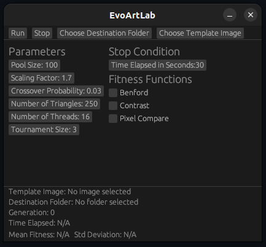
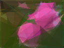
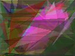

# EvoArtLab

EvoArtLab é uma ferramenta educativa de código aberto escrita em Rust que permite ao usuário experimentar com medidas estéticas para a geração de arte evolucionária. A estética computacional é um campo de pesquisa que busca replicar decisões estéticas humanas por meio de métodos computacionais, sendo amplamente utilizada na criação de artes evolucionárias. Essa ferramenta tem como objetivo permitir aos usuários explorar o impacto de diferentes medidas estéticas em imagens geradas por algoritmos evolucionários. Utilizando o algoritmo Evolução Diferencial (DE) juntamente com o algoritmo NSGA-II, a fim de combinar múltiplas medidas estéticas, a ferramenta possibilita o uso de medidas estéticas e a análise de seus efeitos em tempo real. Usuários avançados também podem implementar novas medidas, ampliando o potencial da ferramenta.

## Instalação

Para instalar a ferramenta, basta baixar o executável que se encontra na página de Releases do repositório e executá-lo.

Caso seu sistema operacional não seja o Linux ou caso você deseje adicionar novas medidas estéticas, você precisará compilar o executável do zero.

### Compilação

A compilação do projeto é totalmente configurada pela ferramenta Cargo de Rust. Uma vez que esteja no diretório desse repositório, basta usar o comando abaixo para fazer a compilação do projeto como um todo.

    cargo build --release

## Usagem

<div align="center">
    
  </a>
</div>

A GUI oferecida pela ferramenta permite ao usuário configurar todos os parâmetros da evolução, juntamente com a condição de parada e quais medidas estéticas, ou fitness functions, serão usadas.

Além disso, os botões no topo permitem selecionar uma imagem base, a qual será fornecida para todas as medidas estéticas que a requisitarem, e também definir qual será o diretório onde a imagem final (ou fronte inteiro final no caso de múltiplas medidas estéticas) será guardada.

Para a escolha da imagem base quanto maior for a resolução da imagem, maior será o tempo necessário para a execução da ferramenta. 

## Exemplos

Todas as fitnesses podem receber uma imagem para ser usada como base, como é o caso da Pixel Compare, que tenta maximizar a quantidade de pixels que são idênticos da imagem base:

<div align="center">
    
  </a>
    
  </a>
</div>

**OBS**: A imagem base utilizada aqui tem como resolução 128x96 pixels!

Também é possível combinar a Pixel Compare com Benford, outra medida estética que tenta fazer com que os valores de luminância de cada pixel da imagem gerada sigam a Lei de Benford de distribuição de números, ou seja, ela não usa a imagem base.

<div align="center">
    
</a>
    
  </a>
</div>

## Adição de Novas Medidas Estéticas

Para usuário mais avançados com um conhecimento básico de Rust é possível a adição de novas medidas estéticas! Toda medida estética é guardada na pasta `src/fitness` dentro do repositório, sendo cada código modularizado. Para criar uma nova medida estética, basta criar um novo arquivo na pasta mencionada com uma função seguindo a assinatura abaixo.

```rust
pub fn calculate_fitness(env: &mut Environment, idx: usize) -> ();
```

Essa função receberá um parâmetro mutável do tipo `Environment`, que possui todas os parâmetros e indivíduos da evolução e um parâmetro do tipo `usize`, que indica qual é o índice que a fitness atual ocupa em cada indivíduo.

Após a criação dessa função, basta adicionar um novo import no início do arquivo `src/main.rs` e pronto! A GUI irá adicionar a medida fitness criada automaticamente como uma nova opção.

É *recomendado* observar as medidas estéticas já criadas para auxiliar na criação de medidas estéticas novas.
